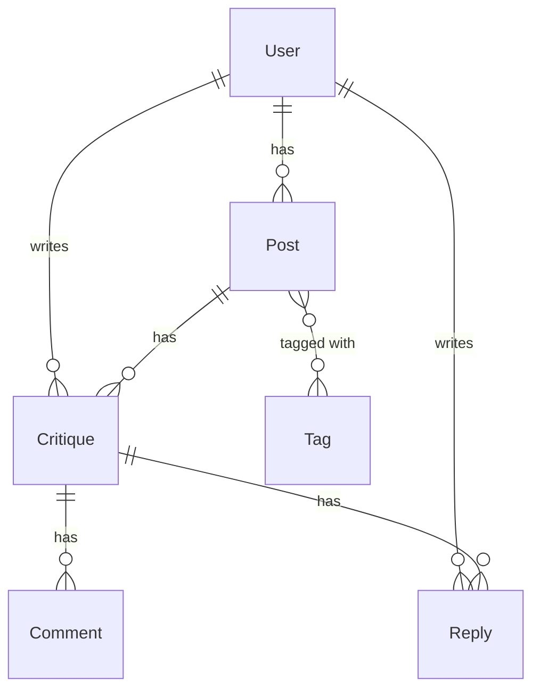

# CoCanvas Backend

CoCanvas Backend is C# .NET Web Api project that exposes RESTful API for the frontend to use

## Clean Architecture

The backend for this project applies Clean Architecture structure. The main application is the Api project (outer layer), and alongside it are class libraries for adopting clean architecture (Infrastructure, Application, Domain, Contract).

### Authorization and Authentication

this is done with AspNetCore.Identity library which exposes endpoints for all things related to logging in, signing up etc.

## Database

The database is created using Entity Framework ORM, which creates a SQL Database



### Migrations

To add or update migrations, run the following, while standing in BackEnd

```
// Add
dotnet ef migrations add MigrationName --project CoCanvas.Infrastructure --startup-project CoCanvas

// Update
dotnet ef database update --project CoCanvas.Infrastructure --startup-project CoCanvas

```
